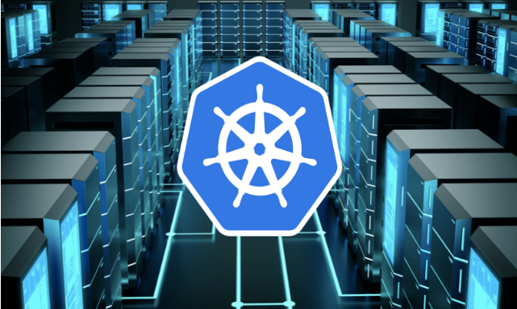

### <b>Overview</b>

The best Kubernetes architecture for your organization depends on your needs and goals. Kubernetes is often described as a cloud-native technology, and it certainly qualifies as one. However, the cloud-native concept does not exclude the use of on-premises infrastructure in cases where it makes sense. Depending on your organization’s needs regarding compliance, locality and cost for running your workloads, there may be significant advantages to running Kubernetes deployments on-premises.

Kubernetes has achieved an unprecedented adoption rate, due in part to the fact that it substantially simplifies the deployment and management of microservices. Almost equally important is that it allows users who are unable to utilize the public cloud to operate in a “cloud-like” environment. It does this by decoupling dependencies and abstracting infrastructure away from your application stack, giving you the portability and the scalability that’s associated with cloud-native applications.

### <b>Why Run Kubernetes On-premises</b>
Why do organizations choose the path of running Kubernetes in their own data centers, compared to the relative “cake-walk” with public cloud providers? There are typically a few important reasons why an Enterprise may choose to invest in a Kubernetes on-premises strategy:

1. Compliance & Data Privacy
Some organizations simply can’t use the public cloud, as they are bound by stringent regulations related to compliance and data privacy issues. For example, the GDPR compliance rules may prevent enterprises from serving customers in the european region using services hosted in certain public clouds.

2. Business Policy Reasons
Business policy needs, such as having to run your workloads at specific geographical locations, may make it difficult to use public clouds. Some enterprises may not be able to utilize public cloud offerings from a specific cloud provider due to their business policies related to competition.

3. Being Cloud Agnostic to Avoid Lock-in
Many enterprises may wish to not be tried to a single cloud provider, and hence may want to deploy their applications across multiple clouds, including an on-premises private cloud. This reduces your risk of business continuity impact due to issues with a specific cloud provider. It also gives you /<b>leverage around price negotiation</b> with your cloud providers.

4. Cost
This is probably <b>the most important reason</b> to run Kubernetes on-premises. Running all of your applications in the public clouds can get pretty expensive at scale. Specifically if your applications <b>rely on ingesting and processing a large amount of data</b>, such as an AI/ML application, it can get extremely expensive to run it in a public cloud. If you have existing data centers on-premises or in a co-location hosted facility, running Kubernetes on-premises can be an effective way to reduce your operational costs. For more information on this topic, see this latest report from a16z: The Cost of Cloud, a Trillion Dollar Paradox Quoted from the report ” It’s becoming evident that while cloud clearly delivers on its promise early on in a company’s journey, the pressure it puts on margins can start to outweigh the benefits, as a company scales and growth slows. Because this shift happens later in a company’s life, it is difficult to reverse as it’s a result of years of development focused on new features, and not infrastructure optimization”

An effective strategy to run Kubernetes on-premises on your own data centers can be used to transform your business and modernize your applications for cloud-native – while improving infrastructure utilization and saving costs at the same time.

### <b>Challenges Running Kubernetes On-premises</b>
There is a downside to running Kubernetes on-premises however, specially if you are going the Do-It-Yourself (DIY) route. Kubernetes is known for its steep learning curve and operational complexity. When using Kubernetes on AWS or Azure – your public cloud provider essentially hides all the complexities from you. Running Kubernetes on-premises means you’re on your own for managing these complexities. Here are specific areas where the complexities are involved:

1. Etcd – manage highly available etcd cluster. You need to take frequent backups to ensure business continuity in case the cluster goes down and the etcd data is lost.

2. Load balancing – Load balancing may be needed both for your cluster master nodes and your application services running on Kubernetes. Depending on your existing networking setup, you may want to use a load balancer such as F5 or use a software load balancer such as metallb.

3. Availability – Its critical to ensure that your Kubernetes infrastructure is highly available and can withstand data center and infrastructure downtimes. This would mean having multiple master nodes per cluster, and when relevant, having multiple Kubernetes clusters, across different availability zones.

4. Auto-scaling – Auto-scaling for the nodes of your cluster can help save resources because the clusters can automatically expand and contract depending on workload needs. This is difficult to achieve for bare metal Kubernetes clusters, unless you are using a bare metal automation platform such as open source Ironic or Platform9’s Managed Bare Metal.

5. Networking – Networking is very specific to your data center configuration.

6. Persistent storage – Majority of your production workloads running on Kubernetes will require persistent storage – block or file storage. The good news is that most of the popular enterprise storage vendors have CSI plugins and supported integrations with Kubernetes. You will need to work with your storage vendor to identify the right plugin and install any additional needed components before you can integration your existing storage solution with Kubernetes on-premises.

7. Upgrades – You will need to upgrade your clusters roughly every 3 months when a new upstream version of Kubernetes is released. The version upgrade may create issues if there are API incompatibilities introduced with newer version of Kubernetes. A staged upgrading strategy where your development / test clusters are upgraded first before upgrading your production clusters is recommended.

8. Monitoring – You will need to invest in tooling to monitor the health of your Kubernetes clusters in your on-premise Kubernetes environment. If you have existing monitoring and log management tools such as Datadog or Splunk, most of them have specific capabilities around Kubernetes monitoring. Or you may consider investing in an open source monitoring stack designed to help you monitor Kubernetes clusters such as Prometheus and Grafana.

### <b>Best Practices for Kubernetes On-premises</b>
Below you will find a set of best practices to run Kubernetes on-premises. Depending on your environment configuration, some or all of these may apply to you.

<b>Integrating with Existing Environment</b>

Kubernetes enables users to run clusters on a diverse set of infrastructures on-premises . So you can “repurpose” your environment to integrate with Kubernetes – using virtual machines or creating your own cluster from scratch on bare metal. But you would need to build a deep understanding of the specifics of deploying Kubernetes on your existing environment, including your servers, storage systems, and networking infrastructure, to get a well configured production Kubernetes environment.

The three most popular ways to deploy Kubernetes on-premises are:

1. Virtual machines on your existing VMware vSphere environment

2. Linux physical servers running Ubuntu, CentOS or RHEL Linux

3. Virtual machines on other types of IaaS environments on-premises such as OpenStack.

Running Kubernetes on physical servers can give you native hardware performance, which may be critical for certain types of workloads, however it may limit your ability to quickly scale your infrastructure. If getting bare metal performance is important to you, and if you need to run Kubernetes clusters at scale, then consider investing in a bare metal automation platform such as Ironic , Metal3 or a managed bare metal stack such as Platform9 Managed Bare Metal.
Running Kubernetes on virtual machines in your private cloud on VMware or KVM can give you the elasticity of cloud, as you can dynamically scale your Kubernetes clusters up or down based on workload demand. Clusters created on virtual machines are also easy to setup and tear down, making it easy to create ephemeral test environments for developers.
