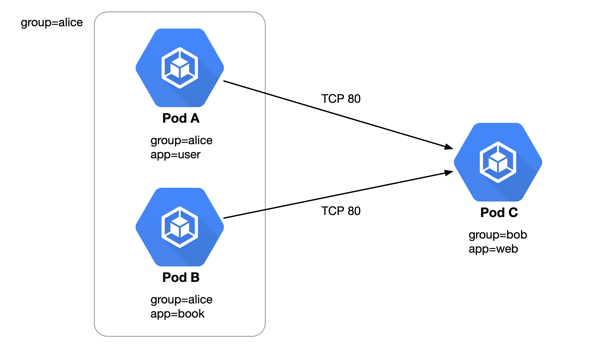
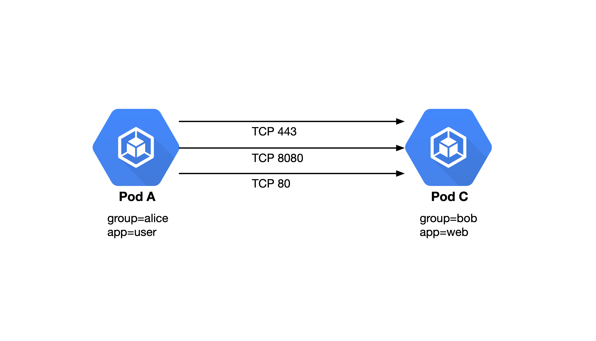
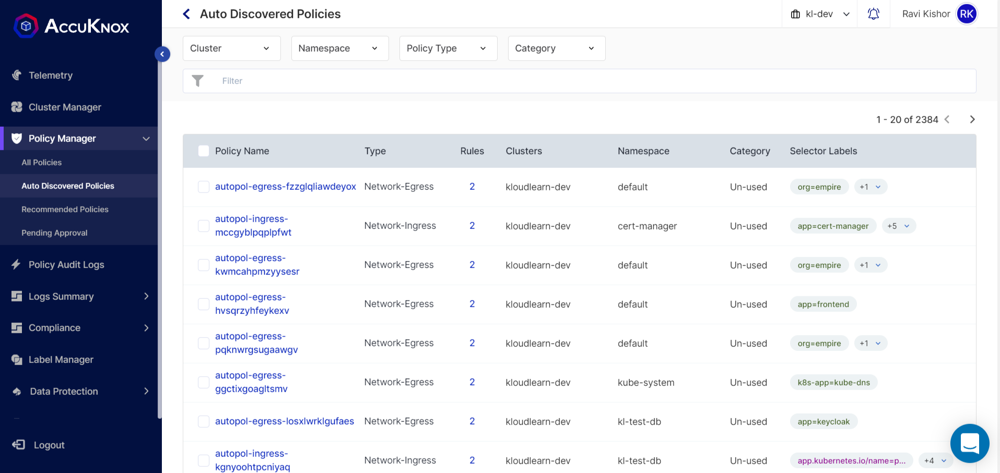
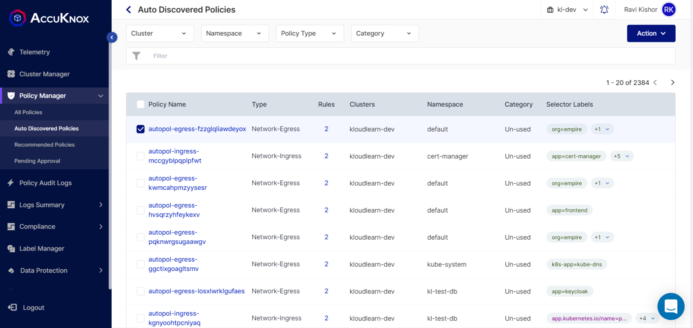
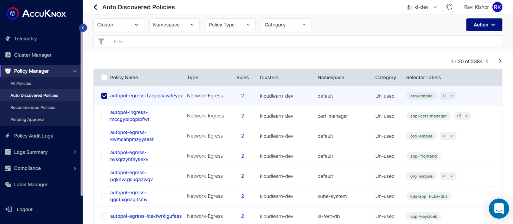
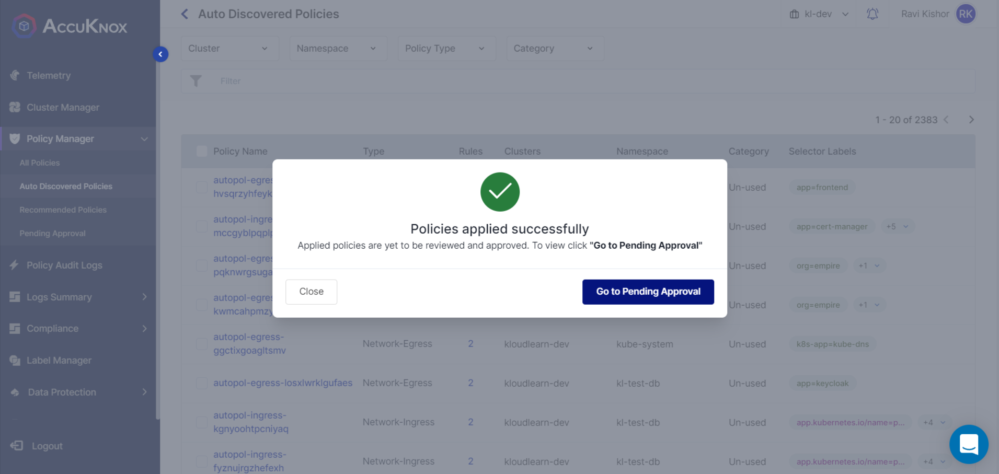
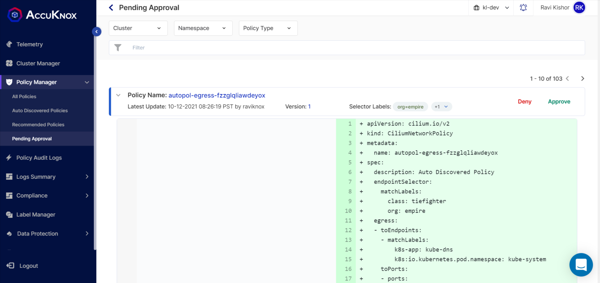

Auto Discovery is a policy recommendation system that suggests network and system policies based on the collected network and system logs respectively.

Auto Discovery is designed for Kubernetes environments; it focuses on pods/services, and its fundamental principle is to produce a minimal network and system policy set covering maximum behavior. To do this, we actively use the label information assigned from the Kubernetes workloads/resources.

Currently, Auto Discovery can discover (i) egress/ingress network policy for Pod-to- Pod, (External)Service, Entity, CIDR, FQDN, HTTP. And, In the System perspective it can discover (ii) process, file, and network-relevant system policy.

## Functionality Overview

-   Produce a minimum network policy set covering maximum network flows

    - When discovering the network policies, if we generate the policies applied to a single pod statically, there would be lots of network policies. In contrast, Auto Discovery produces the minimum network policy set that can cover the maximum network flows so that we can manage the network policies more efficiently and effectively. For example, Auto Discovery collects the label information of the pods, and then computes the intersection of labels, which is the most included in the source (or destination) pods.

-   Identify overlapped network policy

    -   Regarding the external destination, Auto Discovery builds CIDR or FQDN-based policies, and to do this it takes two steps. First, if it comes across the external IP address as the destination, it tries to convert the IP address to the domain name by leveraging the reverse domain services. Next, if it fails to find the domain name, it retrieves the domain name from an internal map that matches the domain name to the IP address collected by DNS query and response packets from the kube-dns traffic. Thus, building FQDN based policies has a higher priority than CIDR policies.

        Inevitably, CIDR policies could be discovered if there is no information on the matched domain names. However, if we build an FQDN policy that overlaps the prior CIDR policy, Auto Discovery can tag and update those policies so that we can maintain the latest network policies.

-   Operate in runtime or on the collected network logs in advance

    -   Generally, Auto Discovery discovers the network policies by extracting the network logs from the database every time intervals. In addition, It can connect to a log monitor directly (e.g., Cilium Hubble), and receive the network log, and then produce the network policies in runtime.

-   Support various network and system policy discovery modes

    -   Fundamentally, a pod has two types of network policy in Kubernetes; egress and ingress. The egress policy restricts the outbound network flows and the other way, the ingress policy operates against the inbound network flows. In this context, Auto Discovery supports both types of policy discovery modes; egress-centric and ingress-centric. Additionally System-centric also. System Policy can be of process, file, and network types. Thus, users can choose one of them depending on their demand.

## Policy Discovery Examples

### The intersection of matched labels

Let's assume that there are three pods and two connections between them as shown in the above figure. From the network logs from it, the Auto Discovery does not discover the two distinct network policies; [Pod A -> Pod C] and [Pod A -> Pod C].

Instead, since Pod A and Pod B have the intersection of the labels, which is 'group=alice', the knoxAutoPolicy discovers and generates a network policy that has the selector with matchLabels 'group=alice'. Finally, we can get one network policy that covers two distinct network flows [group=alice -> Pod C].

### The aggregation of toPorts rules per the same destination

Similar to the previous case, we can merge the multiple toPorts rules per each same destination. Let's assume that there are the source and destination pods and three different flows as shown in the above figure. In this case, the Auto Discovery does not generate three different network policies per each toPorts rule.

More efficiently, the Auto Discovery discovers one network policy and has one matchLabel rule and three toPorts rules; port numbers are 443, 8080, and 80. From this merge, it can be enabled to produce a minimum network policy set covering maximum network flows.

### The trace of the outdated network policy

Since the Auto Discovery can do the discovery job at the time intervals, there could be some overlapping. For example, as shown in the above figure, let's assume we discovered policy A and B at the time t1 and t2 respectively.

However, policy B has the same toCIDRs rule as policy A does but a different toPorts rule. In this case, It updates policy B by merging the toPorts rule to the latest one, and then it marks policy A as outdated and puts the relevant latest policy name. Thus, users can retrieve only the latest network policies from the database.

## **Auto Discovered Policies Dashboard**

-   You can filter Auto Discovered Policies using following filters:

    -   Cluster :- Filter Policies by clusters belonging to your workspace.

    -   Namespace: Filter Policies by namespaces belonging to selected clusters

    -   Policy-Type: Filter Policies by Policy types. There are 3 Policy types. (i) Network-Ingress (ii) Network-Egress (iii) System Policy

    -   Category: Category will give the status of the policies. There are 2 categories.

        -   Used : When the Policy is applied from the Auto Discovered Policy Screen, It will go to All Policy Screen and Category will be changed to **Used**. You can list all used policies with used category.

        -   Ignore: You can list all ignored policies using this filter.
### **Apply Auto Discovered Policies.**

1.  Select one or more policies from the list
    
    Note: Default screen will show all un-used policies.

2. Click “**Action**” Button on the top right corner.
    
    There are 3 Actions can be performed. (i) Apply (ii) Ignore (iii) Deselect all

3. Click **Apply**. Then Policy will be applied to the cluster. Applied Policy will go to pending approval.
    
4. Go to “Pending Approval” screen and Approve the policy.
    
    Note: You need Administrative permission to approve policies.

5. Approved Policy will go to All Policies Screen.
