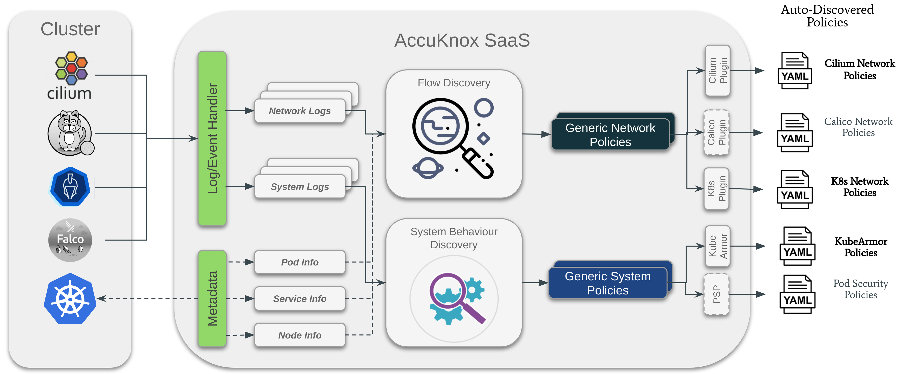

## AccuKnox and Open Source
AccuKnox provides most of the core policy enforcement engines and other associated tooling as open-source. Accuknox believes that a security focussed product needs to have full transparency in its operations and we also believe in the power of community. With that in mind AccuKnox has following open source components:

### Accuknox-Cilium
Accuknox maintains [a fork of cilium](https://github.com/accuknox/cilium) with certain added features. While Accuknox aims to eventually upstream the changes, the upstreaming work progresses at its own pace. [Accuknox-Cilium](https://github.com/accuknox/cilium) currently has following additional features:

* **SPIFFE based Identity Solution**: Accuknox intends to use an Identity layer that is not k8s-dependent and can flexibly scale to any scenarios (IoT, Edge, 5G, VM, Bare-Metal etc). With that in mind, AccuKnox implemented the changes in Cilium control plane to provision the Identity for the workloads based on [SPIFFE](https://spiffe.io/). AccuKnox made use of SPIRE reference implementation and integrated with Cilium. The details of this solution were presented in Kubecon 2021 (Production Identity Day) event and [the recording](https://www.youtube.com/watch?v=V4eiX9Lx0H8) is available here. The [upstreaming work](https://github.com/cilium/cilium/pull/17335) for this feature is currently in progress.

* **Policy Audit/Staging**: Policy audit/staging is an important feature that allows the user to validate the impact of policy before enforcing it. If there are connections or packets denied due to an application of a new policy that will show up in the audit policies whilst the application would still continue functioning. Cilium policies [currently](https://github.com/cilium/cilium/issues/9580) cannot be audited on per policy basis. This feature developed by Accuknox allows to handle two things:
    * Get policy details on per alert/telemetry basis. With this it would be possible to get the policy statistics such as denied packets/connections on per policy basis.
    * Allow policy audit configuration on per policy basis.

### KubeArmor
[KubeArmor](https://github.com/kubearmor/kubearmor) is a cloud-native runtime security enforcement system that restricts the behavior (such as process execution, file access, and networking operation) of containers and nodes at the system level. With KubeArmor, a user can:
* restrict file system access for certain processes
* restrict what processes can be spawned within the pod
* restrict the capabilities that can be used by the processes within the pod

KubeArmor differs from seccomp based profiles, wherein KubeArmor allows to dynamically set the restrictions on the pod. With seccomp the restrictions must be placed during the pod startup and cannot be changed later. KubeArmor leverages Linux Security Modules (LSMs) to enforce policies at runtime.

### Policy Auto Discovery
Accuknox policy enforcement engines based on KubeArmor and Cilium are very flexible and powerful. However, these policy engines must be fed with policies. With 10s or 100s of pods and workloads running in a cluster it is insanely difficult to handcraft such policies. Accuknox policy auto-discovery engine leverages the pod visibility provided by KubeArmor and Cilium to auto-generate network and system policies.

