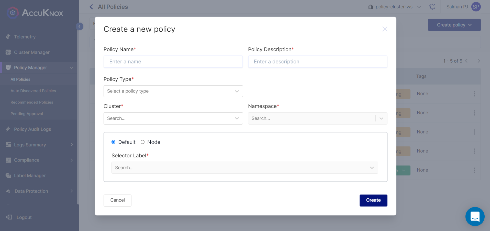
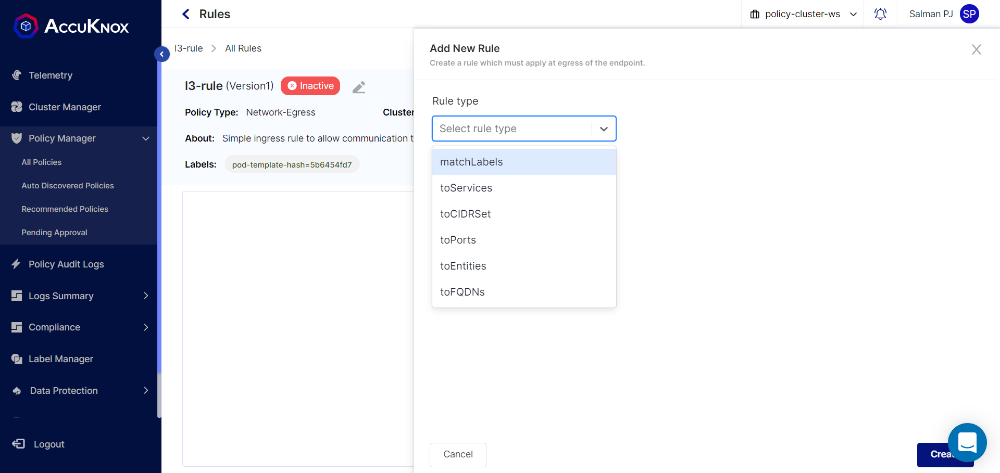
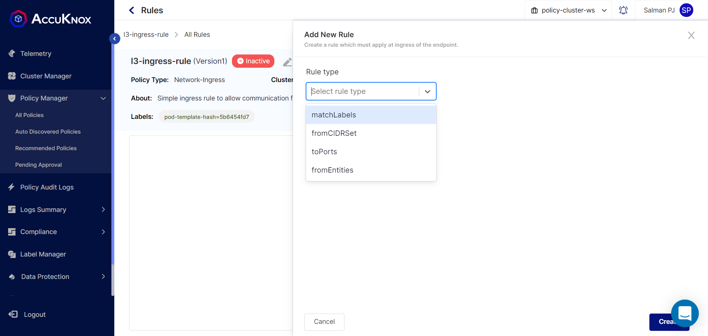
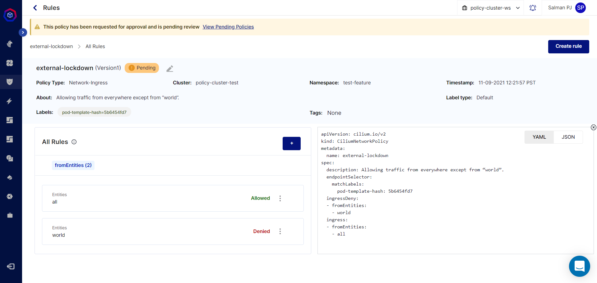

## Policies and rules

Accuknox support three types of policies. Network-Ingress, Network-Egress and System Policies.

The egress policy restricts the outbound network flows and the other way, the ingress policy operates against the inbound network flows. System Policy restricts the behavior (such as process execution, file access, networking operation and capabilities) of pods and nodes at the system level.

### Structure of network policy

Network-egress Policy Specification

    apiVersion: "cilium.io/v2"
    kind: CiliumNetworkPolicy
    metadata:
      name: [policy name]
      description: [Policy Desciption]
    spec:
      endpointSelector:          
        matchLabels:
          [key1]: [value1]
          [keyN]: [valueN]
    egress:
      - toEndpoints:
        - matchLabels:
            [key1]: [value1]
            [keyN]: [valueN]
      - toPorts:
        - ports:
          - port: [port number]
            protocol: [protocol]
      - toCIDRSet:
        - cidr: [ip addr]/[cidr bits]
          except:
          - [ip addr]/[cidr bits]
      - toEntities:
        - [entity]
      - toServices:
        - k8sService:
            serviceName: [service name]
            namespace: [namespace] 
      - toFQDNs:
          - matchName: [domain name]
          - matchPattern: [domain name pattern]

Network-ingress Policy Specification

    apiVersion: "cilium.io/v2"
    kind: CiliumNetworkPolicy
    metadata:
      name: [policy name]
      description: [Policy Desciption]
    spec:
      endpointSelector:          
        matchLabels:
          [key1]: [value1]
          [keyN]: [valueN]
    ingress:
      - toPorts:
        - ports:
          - port: [port number]
            protocol: [protocol]
      - fromEndpoints:
        - matchLabels:
            [key1]: [value1]
            [keyN]: [valueN]
      - fromEntities:
        - [entity]
      - fromCIDRSet:
        - cidr: [ip addr]/[cidr bits]
          except:
          - [ip addr]/[cidr bits]

#### Policy Spec Description

Here, we will briefly explain how to define the network policy.

A network policy starts with base information such as

-   Policy Name

    -   Name of the Policy

-   Description

    -   Description for the Policy

-   Policy Type

    -   Policy Type can be Network-Ingress, Network-Egress and System. Ingress-Policy will apply to all network packets which are entering the endpoint. Egress-Policy will apply to all network packets which are leaving the endpoint. System Policy will restricts behavior at system level.

-   Namespace

    -   Namespace will tell in which namespace that policy is going to apply.

-   Default/Node

    -   This is used to differentiate between Endpoint Selector(default) and Node Selector(Node). It is called Endpoint Selector because it only applies to labels associated with an Endpoint. Node Selector applies to labels associated with a node in the cluster. Node Selectors can only be used in CiliumClusterwideNetworkPolicy. If you change here from default to node then kind will get changed from `CiliumNetworkPolicy` to `CiliumClusterwideNetworkPolicy`

-   Labels

    -   Labels are used to select specified endpoints (in most cases it will be pods) and nodes.

After creating policy following yaml will be filled.

    apiVersion: "cilium.io/v2"
    kind: CiliumNetworkPolicy
    metadata:
      name: [policy name]
      description: [Policy Desciption]
    spec:
      endpointSelector:          
        matchLabels:
          [key1]: [value1]
          [keyN]: [valueN]

**Egress:** In the egress rule, we have 6 different types. First, matchLabels is the same as the selector case, so we can specify the destination based on the labels.

toPorts is a list of the port filter, and the port and protocol mean the port number and its protocol respectively. It restricts the ability of an endpoint to emit and/or receive packets on a particular port using a particular protocol.

toCIDRSet rules are used to define policies to limit external access to a particular IP range.

toEntities rules are used to describe the entities that can be accessed by the selector. The applicable entities are host (the local host), remote-node (other hosts in the cluster than the local host), world (the same as CIDR 0.0.0.0/0) and all.

toServices rules can be used to restrict access to the service running in the cluster. But, these services should not use the selector. In other words, it supports the services without the selector only. Thus, if users want to use toServices rules, there should be the service and its endpoints respectively.

toFQDNs rules are used to define the policies that have DNS queryable domain names.

    ingress:
      - toPorts:
        - ports:
          - port: [port number]
            protocol: [protocol]
      - fromEndpoints:
        - matchLabels:
            [key1]: [value1]
            [keyN]: [valueN]
      - fromEntities:
        - [entity]
      - fromCIDRSet:
        - cidr: [ip addr]/[cidr bits]
          except:
          - [ip addr]/[cidr bits] 

**Ingress:** In the ingress rule, we have 4 different types; matchLables, toPorts, fromEntities and fromCIDRSet And these are working as the egress does.

    ingress:
      - toPorts:
        - ports:
          - port: [port number]
            protocol: [protocol]
      - fromEndpoints:
        - matchLabels:
            [key1]: [value1]
            [keyN]: [valueN]
      - fromEntities:
        - [entity]
      - fromCIDRSet:
        - cidr: [ip addr]/[cidr bits]
          except:
          - [ip addr]/[cidr bits] 

### Deny Policies

Deny policies allows to explicitly restrict certain traffic to and from a Pod. Deny policies take precedence over allow policies.

Policy Structure

Existing inter-cluster policies will still be allowed as this policy is allowing traffic from everywhere except from “world”.

### Host Policies

Host policies take the form of a CiliumClusterwideNetworkPolicy with a Node Selector instead of an Default Selector.

Host policies apply to all the nodes selected by their Node Selector.

### Structure of System Policy

#### Policy Specification

    apiVersion: security.kubearmor.com/v1
    kind:KubeArmorPolicy
    metadata:
      name: [policy name]
      namespace: [namespace name]
    spec:                       
      selector:                               # --> For KubeArmorHostPolicy selector will be nodeSelector
        matchLabels:
          [key1]: [value1]
          [keyN]: [valueN]

      process:
        severity: [1-10]                       
        matchPaths:
        - path: [absolute executable path]
          ownerOnly: [true|false]              # --> optional
          fromSource:                          # --> optional
          - path: [absolute exectuable path]
        matchDirectories:
        - dir: [absolute directory path]
          recursive: [true|false]              # --> optional
          ownerOnly: [true|false]              # --> optional
          fromSource:                          # --> optional
          - path: [absolute exectuable path]
        action: [Allow|Audit|Block]

      file:
        severity: [1-10]                       
        matchPaths:
        - path: [absolute file path]
          readOnly: [true|false]               # --> optional
          ownerOnly: [true|false]              # --> optional
          fromSource:                          # --> optional
          - path: [absolute exectuable path]
        matchDirectories:
        - dir: [absolute directory path]
          recursive: [true|false]              # --> optional
          readOnly: [true|false]               # --> optional
          ownerOnly: [true|false]              # --> optional
          fromSource:                          # --> optional
          - path: [absolute exectuable path]
        action: [Allow|Audit|Block]

      network:
        severity: [1-10]                       
        matchProtocols:
        - protocol: [TCP|tcp|UDP|udp|ICMP|icmp]
          fromSource:                          # --> optional
          - path: [absolute exectuable path]
        action: [Allow|Audit|Block]

      capabilities:
        severity: [1-10]                       
        matchCapabilities:
        - capability: [capability name]
          fromSource:                          # --> optional
          - path: [absolute exectuable path]
        action: [Allow|Audit|Block]

#### Policy Spec Description

Now, we will briefly explain how to define a system policy.

-   Common

    A security policy starts with the base information such as apiVersion, kind, and metadata. The apiVersion and kind would be the same in any security policies. In the case of metadata, you need to specify the names of a policy and a namespace where you want to apply the policy.

-   Severity

    The severity part is somewhat important. You can specify the severity of a given policy from 1 to 10. This severity will appear in alerts when policy violations happen.

-   Selector

    The selector part is relatively straightforward. Similar to other Kubernetes configurations, you can specify (a group of) pods based on labels.

-   Process

    In the process section, there are 2 types of matches: matchPaths and matchDirectories. You can define specific executables using matchPaths or all executables in specific directories using matchDirectories. In Each match, there are three options.

    -   ownerOnly (static action: allow owner only; otherwise block all)

        If this is enabled, the owners of the executable(s) defined with matchPaths and matchDirectories will be only allowed to execute.

    -   recursive

        If this is enabled, the coverage will extend to the subdirectories of the directory defined with matchDirectories.

    -   fromSource

        If a path is specified in fromSource, the executable at the path will be allowed/blocked to execute the executables defined with matchPaths or matchDirectories.

-   File

    The file section is quite similar to the process section. The only difference between 'process' and 'file' is the readOnly option.

    -   readOnly (static action: allow to read only; otherwise block all)

        If this is enabled, the read operation will be only allowed, and any other operations (e.g., write) will be blocked.

-   Network

    In the case of network, there is currently one match type: matchProtocols. You can define specific protocols among TCP, UDP, and ICMP.

-   Capabilities

    In the case of capabilities, there is currently one match type: matchCapabilities. You can define specific capability names to allow or block using matchCapabilities.

-   Action

    The action could be Allow, Audit, or Block. Security policies would be handled in a blacklist manner or a whitelist manner according to the action. Thus, you need to define the action carefully. In the case of the Audit action, we can use this action for policy verification before applying a security policy with the Block action.

#### System Policy Specification for Hosts

Policy Specification for Host is similar to the previous one. We will point out only differences.

-   In host policy kind will be KubeArmorHostPolicy, not KubeArmorPolicy.

-   NodeSelector

    -   The node selector part is relatively straightforward. Similar to other Kubernetes configurations, you can specify (a group of) nodes based on labels.

-   Action

    The action could be Audit or Block in general. In order to use the Allow action, you should define 'fromSource'; otherwise, all Allow actions will be ignored by default.

    ` action: [Audit|Block]`

    If 'fromSource' is defined, we can use all actions for specific rules.

    `    action: [Allow|Audit|Block]`
